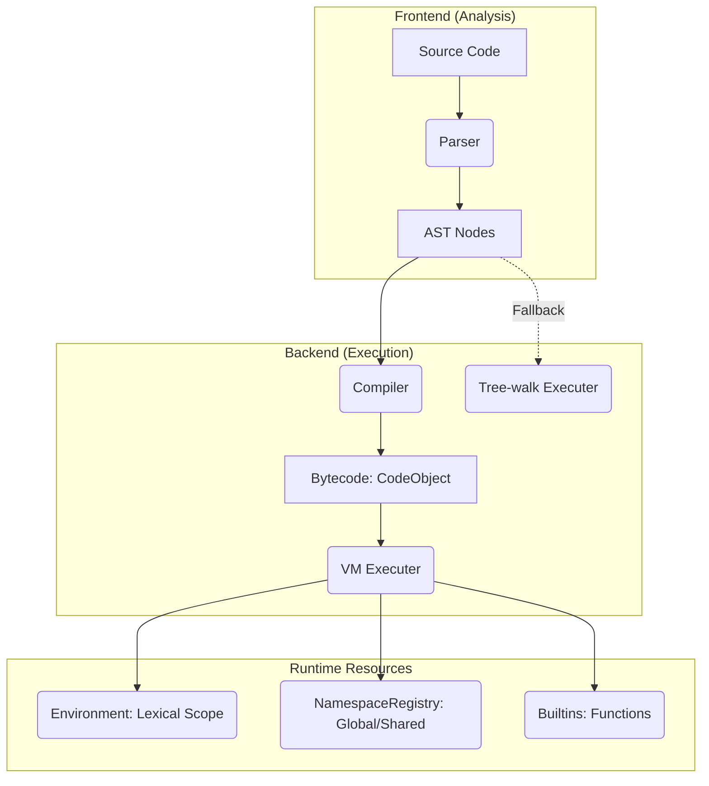
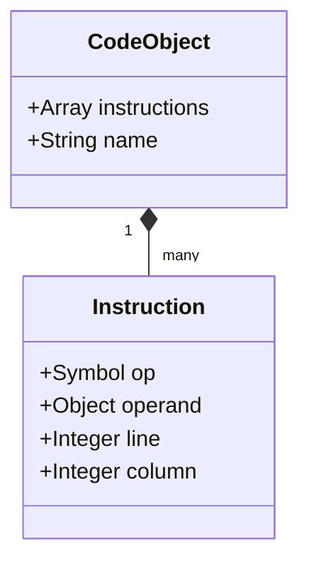

# Design

この文書は「現在の実装設計」を説明する。
`spec.md` は Calc 言語仕様（文法・意味論・言語レベルのエラー）に限定する。
インタプリタ実装/運用仕様（実行モード、CLI オプション、トレース、VM/tree 併存方針）はこの文書の対象とする。

## 1. Positioning & Spec Boundary

  * **[docs/spec.md](https://www.google.com/search?q=docs/spec.md)**: 言語構文（S式、リテラル、special form）、評価意味論（truthiness、名前解決ルール）、言語レベルのエラーに限定する。
  * **[docs/design.md](https://www.google.com/search?q=docs/design.md)**: 現行コードベースの設計、コンポーネントの責務分割、実行戦略、および運用機能（CLI オプション、トレース）を対象とする。

-----

## 2. Architecture Overview

Calc はソースコードから AST を生成し、Bytecode VM 実行を既定としつつ、Tree-walk 評価をフォールバックとして維持する構成をとる。



-----

## 3. Runtime Strategy

### 3.1 実行モードとターゲット

  * **実行環境**: Ruby 3.2, 3.3, 3.4, 4.0 をターゲットとし、CI で動作を保証する。
  * **モード**: 既定実行系は VM（`CALC_EXECUTER_MODE=vm`）。Tree-walk は保守が困難になるまで並存させる。
  * **並列性**: 全ての実行コンポーネント（Executer, VM, Parser等）はインスタンス化されており、互いに独立している。そのため、スレッドごとに Executer を作成することで、Ruby レベルでの安全な並列実行が可能である。

### 3.2 評価スタックと名前解決

VM は実行（`run`）ごとに独立したスタックを確保する。

| カテゴリ | 管理手法 | 役割 |
| :--- | :--- | :--- |
| **評価スタック** | `stack = []` (Local) | 値の受け渡し、関数引数のスタック積み。 |
| **字句スコープ** | `Environment` | クロージャによるキャプチャ、ローカル変数。 |
| **名前空間** | `NamespaceRegistry` | `(define ...)` による永続的な定義、`_` 始まりのローカル名管理。 |
| **組み込み** | `Builtins` | `+`, `-`, `list` などの標準関数レジストリ。 |

### 3.3 評価スタック

VM は `run(code)` の呼び出しごとに評価スタック（`stack = []`）を1本ローカルで確保する。  
スタックは命令列を通じて共有され、関数呼び出しは `call N` 命令で callable と引数を pop し結果を push する。  
別途 `namespace_frames = []` があるが、これは値スタックではなく namespace 復帰先を積む専用の補助リストである。

### 3.4 名前束縛の保存先

定義した変数・関数の保存先は「どの namespace で定義されたか」によって決まる。

| 状況 | Environment | NamespaceRegistry |
|---|---|---|
| `(define x 1)` — トップレベル（namespace なし） | 書き込む | 書き込む |
| `(define x 1)` — namespace ブロック内 | 書き込まない | 書き込む |
| `(define (f x) ...)` — 関数定義 | 書き込まない | 書き込む（関数として登録） |
| lambda 呼び出し時の引数束縛 | 新 Environment を生成して書き込む | 書き込まない |

### 3.5 名前解決の優先順位

シンボルを lookup するとき（`load` 命令 → `resolve_symbol_name`）は次の順で探す。

1. `Environment#get_local`（現スコープのローカル変数）
2. `Builtins#resolve`（組み込みリテラル）
3. `Environment#get`（字句スコープ全体）
4. `NamespaceRegistry#resolve_variable`（namespace 変数）
5. `NamespaceRegistry#resolve_function`（namespace 関数）

関数として呼ぶとき（`load_fn` 命令 → `resolve_callable_name`）は Builtins → Environment（LambdaValue のみ） → NamespaceRegistry 関数 の順で探す。

### 3.6 Lambda Representation

`LambdaValue` は移行互換のために次を持つ:

- `params`
- `body`（AST body）
- `environment`（定義時スナップショット）
- `namespace`
- `code_body`（VM 用 bytecode body）

`code_body` がある場合は VM 実行、ない場合は tree-walk 実行。


-----

## 4. Data Structures

### 4.1 AST Node Types

Parser が生成する全ノードは `line` / `column`（ソース位置情報）を保持する。

  * **NumberNode**: `BigDecimal` による数値。
  * **StringNode**: 文字列。
  * **KeywordNode**: `:name` 形式のキーワード。
  * **SymbolNode**: 識別子（変数・関数名）。
  * **ListNode**: S式リスト。
  * **LambdaNode**: `(lambda (params...) body)` 構文。

### 4.2 Node

#### 4.2.1 NumberNode

数値リテラル。

| フィールド | 型 | 内容 |
|---|---|---|
| `value` | `BigDecimal` | 数値 |
| `line` | `Integer` | 行番号 |
| `column` | `Integer` | 列番号 |

```
42  =>  NumberNode(value=42)
```

#### 4.2.2 StringNode

文字列リテラル。

| フィールド | 型 | 内容 |
|---|---|---|
| `value` | `String` | 文字列値 |
| `line` | `Integer` | 行番号 |
| `column` | `Integer` | 列番号 |

```
"hello"  =>  StringNode(value="hello")
```

#### 4.2.3 KeywordNode

キーワードリテラル（`:name` 形式）。

| フィールド | 型 | 内容 |
|---|---|---|
| `name` | `String` | `:` を除いたキーワード名 |
| `line` | `Integer` | 行番号 |
| `column` | `Integer` | 列番号 |

```
:foo  =>  KeywordNode(name="foo")
```

#### 4.2.4 SymbolNode

識別子。変数名・関数名・special form キーワードなどに使われる。

| フィールド | 型 | 内容 |
|---|---|---|
| `name` | `String` | シンボル名 |
| `line` | `Integer` | 行番号 |
| `column` | `Integer` | 列番号 |

```
foo  =>  SymbolNode(name="foo")
```

#### 4.2.5 ListNode

S式リスト。先頭子ノードが SymbolNode のとき special form または関数呼び出しになる。

| フィールド | 型 | 内容 |
|---|---|---|
| `children` | `Array<Node>` | 要素ノードの配列 |
| `line` | `Integer` | 行番号 |
| `column` | `Integer` | 列番号 |

```
(+ 1 2)  =>  ListNode(children=[SymbolNode("+')", NumberNode(1), NumberNode(2)])
```

#### 4.2.6 LambdaNode

`(lambda (params...) body)` 構文。パーサが直接生成する（Compiler は `define` の sugar も LambdaNode 相当に整合させる）。

| フィールド | 型 | 内容 |
|---|---|---|
| `params` | `Array<String>` | パラメータ名の配列 |
| `body` | `Node` | 本体ノード（単一ノードまたは do でラップ） |
| `line` | `Integer` | 行番号 |
| `column` | `Integer` | 列番号 |

```
(lambda (x y) (+ x y))  =>  LambdaNode(params=["x","y"], body=ListNode(...))
```
-----

### 4.2 Bytecode (CodeObject)

`CodeObject` はシリアライズ可能な形式を目指した命令列のコンテナである。



#### 4.2.1 opcode

現行 VM が解釈する opcode は次の通り。

| Opcode | 内容 |
| :--- | :--- |
| `push_const` | 定数をスタックに積む。 |
| `push_keyword` | keyword 文字列（`:name`）をスタックに積む。 |
| `load` / `load_fn` | 変数または関数を解決して積む。 |
| `store` / `store_fn` | 定義（Environment または Namespace への書き込み）。 |
| `make_closure` | クロージャ（LambdaValue）を生成。 |
| `call N` | スタック上の callable と N 個の引数を消費して実行。 |
| `jump` / `jump_false` / `jump_true` | 無条件または条件付きジャンプ。 |
| `pop` | スタックから取り出す。 |
| `dup` | スタックの最上位を複製 |
| `enter_ns` / `leave_ns` | namespace への出入 |
| `load_file` | `load` を実行し結果をスタックに積む |

### 4.3 Stack Convention

* 評価順は左から右
* 関数呼び出し時は `[callable, arg1, ... argN]` の順で積む
* `call N` はこれらを消費し、戻り値 1 つを push

### 4.4 Closure Operand Shape

`make_closure` の operand は Hash で、現行は次を含む。

* `params`: 引数名配列
* `ast_body`: AST 本体（移行互換用）
* `code`: lambda 本体の `CodeObject`

`ast_body` が現行 VM 実装で参照されるため、bytecode 最小化（debug-less）ではこの依存をどう扱うかを別途設計する必要がある。

-----

## 5. Bytecode Persistence (CodeObject)

`CodeObject` は `Instruction` 配列を保持する Ruby オブジェクトであり、構造としてはファイル永続化に向いている。

- `Instruction`: `op`, `a`, `line`, `column`
- `CodeObject`: `instructions`, `name`

現状は parse -> compile -> run の経路のみで、保存済み bytecode を直接ロードして実行する公開 API は未実装。

### 5.1 Debug Info あり（開発向け）

- `line` / `column` を保持し、逆アセンブルやトレースで利用する
- lambda の `make_closure` メタには移行互換のため `ast_body` と `code` を併存する
- 位置情報は保持できるが、コメントや空白を含む元ソースを完全復元する用途には向かない

### 5.2 Debug Info なし（配布向け）

- `line` / `column` を落として命令列を軽量化する構成は可能
- ただし現実装の VM は `make_closure` 実行時に `ast_body` を必須参照するため、`ast_body` を除いた最小 bytecode はそのままでは実行できない
- release プロファイルを成立させるには、`ast_body` なしでも `code` だけでクロージャ生成できる実装への変更が必要

### 5.3 Format Guidance

- 短期実装では Ruby オブジェクトの直列化で保存/読込は可能
- 長期運用では opcode/operand を明示した安定フォーマット（将来互換を考慮）を推奨

## 6. Error Handling & Debugging

### 6.1 例外分類

評価時に発生する例外は以下の分類を維持し、適切なコンテキストを付与する。

  * **`Calc::SyntaxError`**: 解析フェーズでの文法エラー。
  * **`Calc::NameError`**: 未定義の変数・関数の参照。
  * **`Calc::RuntimeError`**: 評価中の一般的なエラー。
  * **`Calc::DivisionByZeroError`**: ゼロ除算。

### 6.2 デバッグ支援（Traceability）

  * **ソース位置の保持**: File 実行時にはソースパスと AST/Instruction が持つ位置情報（line/column）を紐付け、エラー箇所を特定する。
  * **REPL 補助コマンド**: `:ast` で AST 表示、`:bytecode` で逆アセンブル結果を表示可能。
  * **VM トレース**: `CALC_VM_TRACE=1` または `:trace-vm` により、命令インデックス（`bc[0001]`）とスタック遷移をリアルタイムに出力する。

-----

## 7. Future Challenges (Non-goals)

  * **Closure の AST 依存排除**: 現在 `make_closure` が実行時に `ast_body` を参照しているが、これを `code`（CodeObject）のみで完結させ、配布用 Bytecode の軽量化を目指す。
  * **フォーマットの安定化**: 長期運用に向け、Ruby バージョンに依存しない安定した Bytecode 永続化フォーマットの策定。
  * **JIT / 独自の並列処理**: 現在は Ruby 本体の特性を活かし、Executer 単位の並列化に委ねる。
